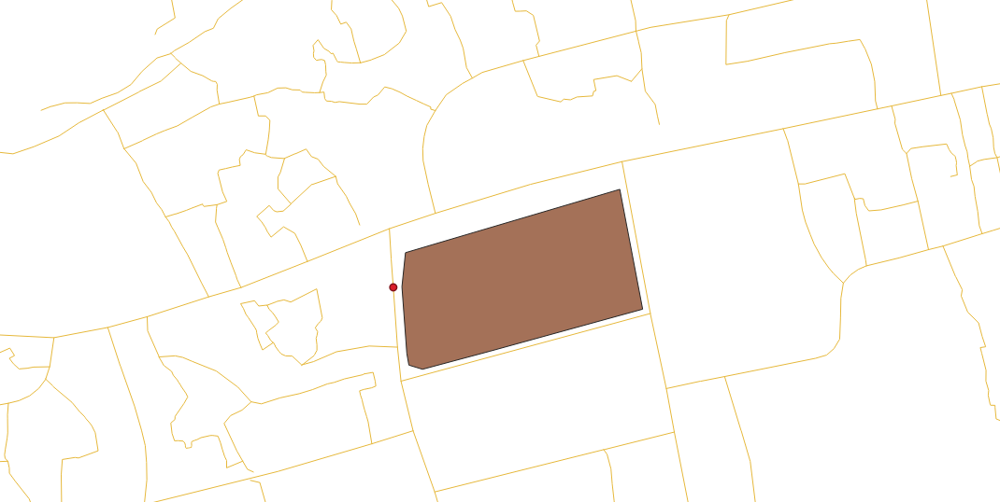
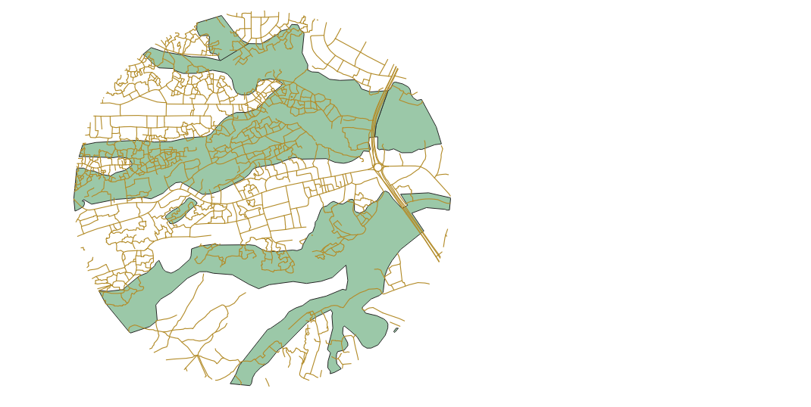
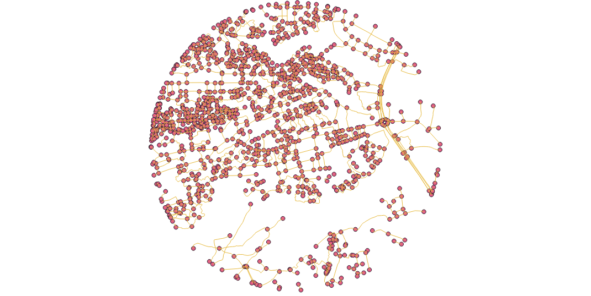
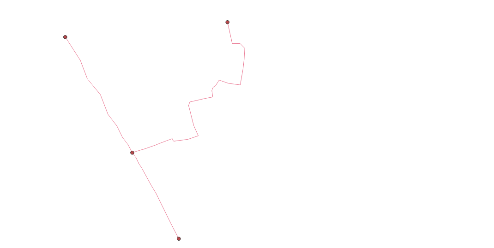
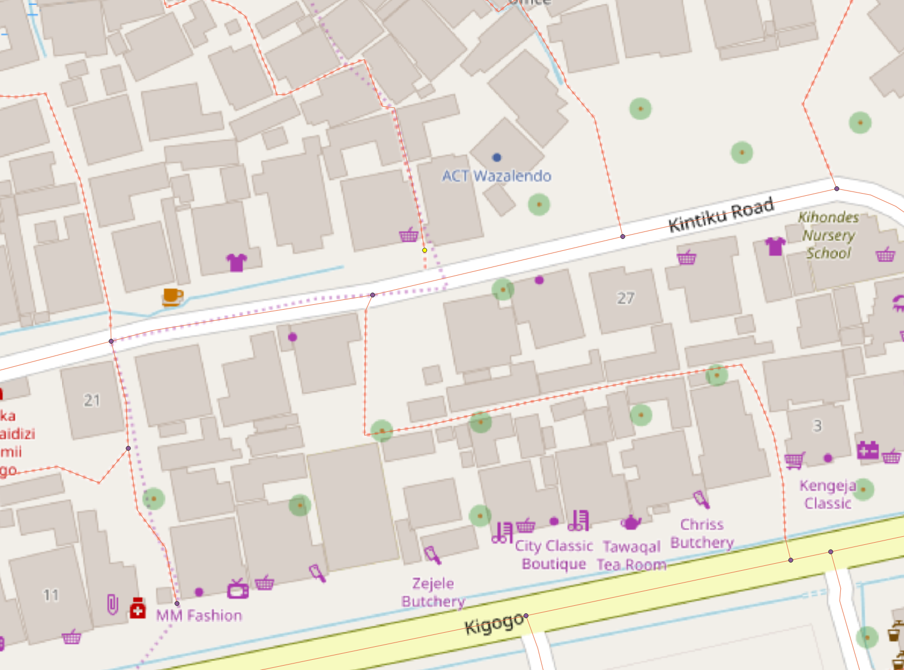
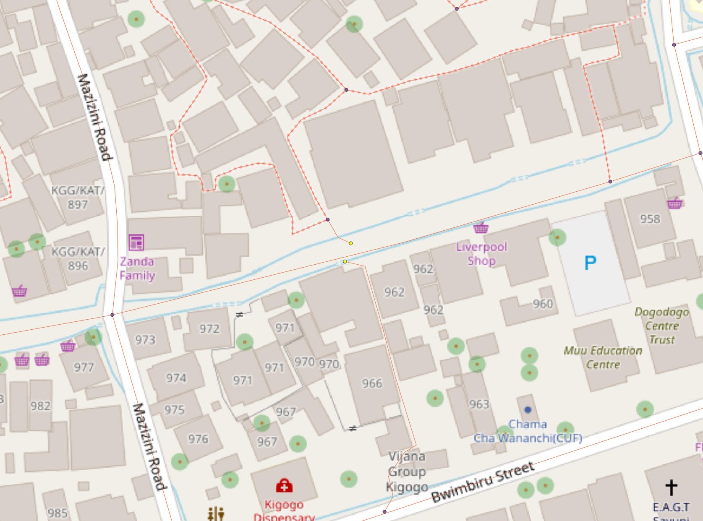

## Network Topology and Walking Time to School

Go to [Part Two of this Lab](../lab_final/node_lab.md)

Return to [QGIS and PostGIS Index Page](../qgis.md).

Return to [Main Index Page](../../index.md).

### Introduction

Dar es Salaam, Tanzania, is a heavily mapped city on OpenStreetMap. This is in part due to numerous initiatives to use geographic information to digitize the city in order to measure indices of urban resiliency and environmental vulnerability. Resilience Academy is a platform which hosts multiple layers of OSM data, clipped to the urban boundaries of the city, and dedicated to the mission of teaching people how to use this spatial information to address problems of urban resiliency. Since there is easy access to extensive data and it is often used for teaching purposes, I decided to use the Dar es Salaam data to learn some basic network analysis functions in PostGIS using the pgrouter extension. 

The general objective that I sought to answer was to measure walking time to school. I wanted to examine one school location as my example and then perform the necessary pgrouting functions to acquire an output of the the accumulated cost of walking time for each network node in the vicinity of the school. Then, as a final product, I wanted to calculate the average walking time cost for all nodes within wetlands and compare to the average cost of nodes outside of wetlands. Wetland settlements are locations which have increased physical vulnerability to flooding events. My question's concept is to see if there is a difference in the amount of infrastructure in wetland terrain compared to terrain that is not wetland, demonstrated through comparatively measuring the connectivity of the road and footpath network to see how well equipped it is to allow children to walk to school. 

However, I encountered a series of problems which prevented me from reaching this output, which I outline below. After I exhausted my attempts to achieve my desired output, I shifted the scope of my project to measure the connectivity of the road network without the consideration of walking time to school. Instead, I calculated the average of how many meters of road there is for every intersectection, comparing the road network within wetlands to terrain that is not a wetland. Click [here](../lab_final/node_lab.md) to view this component of my work on a serparate page.


### Resources 

I used three layers of OpenStreetMap data in Dar es Salaam for this lab: wetlands; roads; schools. I accessed all three of these layers from Resilience Academy through a WFS connection in QGIS. From the QGIS interphase, I uploaded the layers to my PostGIS database and performed the functions of this lab. Within the database, I used the pgrouting extension in addition to standard functions. One of the three layers, wetlands, I already had within my database from a previous [lab](../lab_6/aa_dar_lab.md). I originally created this layer by directly downloading OpenStreetMap polygon data and selecting terrain designated as wetlands. 

I chose to use the school polygon feature rather than the school point feature of Resilience Academy's data. Through a comparison of the two features in QGIS, I noticed that the layers do not always line up. When I viewed each layer in comparison to OpenStreetMap, I noticed that some school point locations overlay locations not designates as a school in the OSM baselayer. While, on the otherhand, the school polygon layer was more agreeable with the baselayer.

### Methodology

In this section, I divided my steps into two distinct components. This first component are the steps with commentary for my attempts to achieve the original lab goal through the pgRouting steps necessary to perform a driving_distance function. Once I realized that this process was not performing correctly, I decided to test the pgrouting functions on a smaller sample of data in Dar es, Salaam. This smaller sample is the worklow and commentary of the second component of the methodology section. 


##### Original Workflow

I first uploaded my Resilience Academy layers from QGIS into the PostGIS database while transforming them into EPSG:32737, or UTM 37S. Since I wanted to examine the road network around a single school, I had to decide which school to use as the basis of my analysis. To reach this decision, I examined all of my layers to determine which school had sufficient road data in its vicinity and a moderate amount of wetland terrain. I used a OSM baselayer to assist me in my decision in order to see if the wetland locations contained settlements which could be the homes of school children. Further, I wanted the school I analysed to be a primary school as this stage in education likely has the largest numbers of young and adolescent children walking to the school. Since the Resilience Academy table for the schools did not contain many proper names, I again used the OSM baselayer to identify school names and ensure I selected a primary school.  

My first phase of steps involved limiting the scope of road and wetland data considered. I decided to establish a 1km buffer around the selected school and exclude all data not within this buffer zone. In order to define the center of the buffer zone, I decided to establish a pointat the location of what most likely appeared as the school's entrance. I made this determination through the examination of imagery on GoogleMaps.

With my school of choice selected, I first turned all the vertices of the school polygon into points.
```sql
create table school_vertices as
select st_dumppoints(geom) as geom
from dar_schools
where id ='way/370703018'
```

The output was not in a well-known text format, so I converted the information into the proper format and turned it into a point on the map. This step was where I encountered my first difficulties. I intended to convert all the polygon's vertices into a mappable point and then select by attribute my desired point, but was unable to determine the correct syntax of functions to do so. I attempted commands with a variety of different functions, such as st_collect, st_astext, st_pointfromtext, st_asewkt, st_geomfromewkt, st_makepoint. However, in the end, I chose to manually input the text of each vertice into the following format until the output was my intended point. Since the school polygon only had nine vertices, this was not a problem. Here is what the attribute table of the polygon veritces looked like.
```sql
create table school_entry as
select row_number() OVER () AS id,
st_pointfromtext(
st_astext('0101000020E17F00001F4CF8AA271920419D22256AD5A26141'),32737) as geom
```

In the next step, I began to consider the requirements of a network topology map and subsequent analyses. In order to perform measurements a noded network, there are three attributes the network table needs - a source point for each line; an end point for each line; a cost perameter such as the line length or time it takes to walk each line. Network analyses calculate the accumulated cost from a chosen source point (or points) to an end point (or points) of the network within the bounds of a specified maximum of accumulated cost. As such, since network topology analyses originate from a source point, I wanted to ensure that I treated the determined entrance to the school as the source point for all network analyses. To achieve this, I first shifted the geometry of my determined school entry point to coincide with the nearest road geometry. I selected the vertice of the polygon which best represented the school entry through a combination of examining the satellite view of the school on GoogleMaps to identify locations where cars could enter the schoolground from the street and through observing an OSM baselayer in order to not consider any side of the school perimeter which was parallel to a drain. I added an image of the output layer of this step after the SQL code. Note how the red dot, representing the school entrance and output of the command, is aligned with the road and shifted away from its originating vertice of the school polygon.
```sql
UPDATE school_entry AS pt 
SET geom =
(SELECT ST_ClosestPoint(ln.geom, pt.geom)
FROM dar_es_salaam_roadss AS ln
ORDER BY pt.geom <-> ln.geom)
  ```
  
  
 
 Now that I had what I considered as the entrance of the school from the road, I created a 1km buffer around this point.
 ```sql
create table school_buff as
select id, st_buffer(geom,1000) as geom
from school_entry
```

I then intersected the road and wetland data with this buffer to exclude all data not within my area of study. A visualization of the selected roads and wetlands is provided below the SQL script.
```sql
CREATE TABLE roads_school AS
SELECT st_multi(st_intersection(a.geom,b.geom)) as geom, b.id as id
FROM school_buff AS a
INNER JOIN dar_es_salaam_roadss AS b
ON (st_intersects(a.geom, b.geom)
AND NOT st_touches (a.geom, b.geom));
create table wetland_school as
select a.id, st_intersection(a.way,b.geom) as geom
from wetlands as a
inner join school_buff as b
on st_intersects(a.way,b.geom)
```



This next step created my noded network topology layer. This inserted an id for each start and end point of the road lines within the attribute table of the road layer and also created a multipoint layer of all source and target points of the roads. Below the command of this step is an image of these two layers. Once I encountered difficulties with the driving_distance function, I exported the node layer from this step and reuploaded as a new layer just to ensure that there was not a scratch layer which may have resulted in irregularities. However, this did not solve the issue.
```sql
alter table roads_school add column source integer;
alter table roads_school add column target integer;
select pgr_createtopology('roads_school', 0.001, 'geom', 'id')
```



At this step, I attempted to split the road that the school point intersects to create a new node on the topology. However, I learned that this is actually difficult to achieve. The following SQL codes are attempts that I made to perform this, but could not determine the proper command. As such, I simply used the nearest node to the school entry point which already existed on the network topology. 
At this stage, I realized it is difficult to split the lines at the location of the school entry point in order to create a new node. Since the school is located near an intersection, this chosen node was not far from the determined school entry.
```sql
UPDATE roads_school AS vr 
SET geom =
(SELECT ST_ClosestPoint(ln.geom, vr.geom)
FROM network AS ln
where st_dwithin(ln.geom,vr.geom,1.0)
ORDER BY vr.geom <->ln.geom))

create table roads_node
select a.id, a.source, a.target, ((st_dump(st_split(a.geom,b.geom))).geom) as geom
from roads_school a
inner join school_entry b
on st_intersects(a.geom,b.geom))

 CREATE TABLE roads_node AS
SELECT a.id, (ST_Dump(ST_split(st_segmentize(a.geom,1),ST_Union(b.geom)))).geom::geometry(LINESTRING,32737) AS geom 
FROM roads_school a, school_entry b
GROUP BY a.id,a.geom
```

As previously explained, network analysis functions require three attribute columns which represent the source, target, and cost of each line segment. In this step, I created the cost column which I defined as the time it takes to walk each line segment. I first measured the length of each line segment, and then used that information to determine the walking time. I relied upon precedent outlined throughout the [pgRouting Workshops](https://workshop.pgrouting.org/) to define 83 meters of length as one minute of walking.
```sql
alter table roads_school add column length float;
update roads_school
set length = st_length(geom);
alter table roads_school add column cost float;
update roads_school
set cost = length/83
```
The following table would have provided me with the information I required to answer my original project goal. The intent of the driving_distance function was to calculate the cost (walking time) from the source node near the school (whose source id is 504) to all target nodes within the set limit of 60 minutes. Further, the function would attach these cost outputs onto each respective node within the node layer. This would enable me to intersect nodes by the wetland feature and then union nodes together in order to find the average walking time for nodes within wetlands and nodes outside of wetlands. Additionally, I would be able to create a concave map of the data from this output to visualize walking time. However, this code did not produce an output. I tried numerous computations of this driving_distance function structure, but none provided an output.

```sql
CREATE OR REPLACE VIEW "driving_nodes" AS 
SELECT di.id, 
       di.source, 
       di.target, 
       di.cost, 
       pt.id, 
       pt.geom 
FROM pgr_drivingdistance('SELECT
     id, 
     source
     target                                  
     cost
       FROM network', 504, 
    60, false, false)
    di(id, source, target, cost)
JOIN nodes pt ON di.source = pt.id;
```

Although this is not a function relevant to my original project intent, I chose to try to perform a simpler pgRouting function in order to see if it would correctly function. This function determines the path of least cost between the defined source point and target point. However, this simpler pathfinding function did not work, either, and resulted in an empty table.
```sql
create table aa as
SELECT * FROM pgr_dijkstra(
    'SELECT id,
         source,
         target,
		 cost
		 FROM roads_school',
    504, 760,
    directed := false)
```


##### Sample Test Workflow
In order to obtain more understanding as to why the previous workflow did not produce answers, I had to repeat the steps but with careful analysis and caution. To limit the potential of data error, I repeated the steps necessary to perform driving_distance with only two roads selected. To limit the chance that personal mistakes created the previous error, I relied heavily on this [guide](https://anitagraser.com/2017/09/11/drive-time-isochrones-from-a-single-shapefile-using-qgis-postgis-and-pgrouting/) to ensure that I made the correct steps and syntax.

```sql
selected two road to test the algorithms

alter table aa_roads drop source;
alter table aa_roads drop target;
alter table aa_roads drop length;
alter table aa_roads drop cost
```
I first dropped the column attached to this layer from the previous analysis attempts to that I approached the test workflow from a clean perspective.

```sql
ALTER TABLE aa_roads ADD COLUMN "source" integer;
ALTER TABLE aa_roads ADD COLUMN "target" integer;
SELECT pgr_createTopology('aa_roads', 0.001, 'geom', 'id');
 CREATE TABLE aa_node AS
   SELECT row_number() OVER (ORDER BY foo.p)::integer AS id,
          foo.p AS the_geom
   FROM (     
      SELECT DISTINCT aa_roads.source AS p FROM aa_roads
      UNION
      SELECT DISTINCT aa_roads.target AS p FROM aa_roads
   ) foo
   GROUP BY foo.p;
   CREATE TABLE aa_network AS
   SELECT a.*, b.id as start_id, c.id as end_id
   FROM aa_roads AS a
      JOIN aa_node AS b ON a.source = b.the_geom
      JOIN aa_node AS c ON a.target = c.the_geom;
```
Here is a visualization of the network map with the newly added source and target columns in its attribute table and of the node layer, produced from the above chunk of SQL codes.



```sql
      
CREATE OR REPLACE VIEW aa_network_nodes AS 
SELECT foo.id,
 st_centroid(st_collect(foo.pt)) AS geom 
FROM ( 
  SELECT aa_network.source AS id,
         st_geometryn (st_multi(aa_network.geom),1) AS pt 
  FROM aa_network
  UNION 
  SELECT aa_network.target AS id, 
         st_boundary(st_multi(aa_network.geom)) AS pt 
  FROM aa_network) foo 
GROUP BY foo.id;
```
Below is a visualization of the above code. Again, for this miniature test run, I completely followed the steps provided from the previous mentioned tutorial on how to perform a driving_distance analysis. I merely renamed the outputs and subsequently reworded the dependent inputs. Yet, this code meant to produce a layer of network nodes formed the graphic below. It seems questionable that nodes do not line up with intersections and not even necessarily with the roads.


```sql

ALTER TABLE aa_network ADD COLUMN length double precision;
UPDATE aa_network set length = st_length(geom);
ALTER TABLE aa_network ADD COLUMN walktime double precision;
UPDATE aa_network set walktime = length/83

CREATE OR REPLACE VIEW "aa_3" AS 
SELECT di.seq, Di.id1, Di.id2, Di.cost,                           
       Pt.id, Pt.geom 
FROM pgr_drivingdistance('SELECT gid::integer AS id,                                       
     Source::integer AS source, Target::integer AS target, 
     Traveltime::double precision AS cost FROM aa_network'::text, 
     3::bigint, 100000::double precision, false, false) 
   di(seq, id1, id2, cost) 
JOIN aa_network_nodes pt 
ON di.id1 = pt.id;
```

This step should have provided me with a driving_distance output, but instead I received an empty table.


### Results and Discussion

Although I did not obtain the results for the original project objective, I did develop valuable insights. A result from the localized test run of the pgRouting steps necessary to culminate in a driving_distance function is that I have a greater suspicion of the data types themself than I do of my syntax throughout the lab as a likely culprit for the lack of an output. This leads me to believe that the road data requires a significant amount of topological cleaning in order to be fit for network analyses. Karduni (2016) notes that many road system datasets have numeruous topology errors which inhibit them from producing an accurate output. 

The following two maps are examples of significant topology error in the road system dataset of Dar es Salaam. Note how the end points of the lines, highlighted yellow, do not ajoin and form a node with the nearby road. In reality, these are intersections. However, as far as the dataset is concerned, these unconnected nodes represent a dead end road or pathway.





However, topological errors such as these would have created a skewed and slightly innaccurate output - they would not prevented the function from running or create an output of an empty table. If we assume that the ultimate reaon for these function failures is topological error, then I have one potential explanation. These figures above represent locations of topological error in the dataset large enough for us to see in its corresponding map. However, there is no guarenteed that all nodes which visually appear to intersect with lines actually do so in the data. Perhaps there are miniscule topology errors like the one in the graphics for many of the nodes - to the degree that network analysis functions cannot perform.

Even though this process forced me to learn a bit about the inner mechanics of driving_distance and the creation of topology maps as I attempted to problem solve, I still wanted to create a mappable output. As such, I used the same node, road, and wetland data from this lab in the procedures of this [project](../lab_final/node_lab.md)


### Cited Literature 

Karduni, A., Kermanshah, A., & Derrible, S. (2016) A protocol to convert spatial polyline data to network formats and applications to world urban road networks. Scientific Data, 3. https://doi.org/10.1038/sdata.2016.46.

---

Go to [Part Two of this Lab](../lab_final/node_lab.md)

Return to [QGIS and PostGIS Index Page](../qgis.md).

Return to [Main Index Page](../../index.md).
