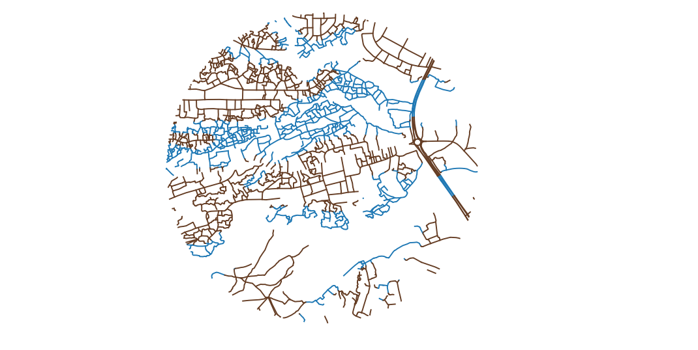

## Measuring Frequency of Pathfinding Options

Return to [QGIS and PostGIS Index Page](../qgis.md).

Return to [Main Index Page](../../index.md).


### Introduction

This lab page documents the continuation from a previous lab which can be viewed [here](../lab_final/lab.md). An overview of the lab and documentation of resources used can be found on the first page of the lab. In this workflow, I analyze to see if there are noticeable infrastructure differences between settlements constructed in wetlands and settlements outside of wetlands in Dar es Salaam, Tanzania. To represent this concept, I calculated the average distance of road there is for every intersection. I chose this calculation as it is representative of the interconnectedness of the road system. A lower value of average road length means that there is a higher proportion of intersections to road length, allowing for more pathfinding options when attempting to transit from one location to another. This infrastructure quality is particularly relevant in the flood prone wetlands as it enables alternative forms of movement if certain road segments experience flooding.

### Methodology

Leaning on the data from the previous [section](../lab_final/lab.md) of this lab, I used road multiline data, the topographic nodes of these roads, and a wetland layer in this analysis. The extent of each of these layers is limited to a 2km diameter circle, a result from the previous section of the lab.


#### Workflow

I first intersected the nodes with the wetland features and applied a value of one for every node which existed in a wetland.

```sql
alter table nodes add column wetland integer;
update nodes set wetland = 1
from wetlands
where st_intersects(nodes.geom, wetlands.way);
update nodes set wetland =  0
where wetland is null
```


Using the value representative of nodes in wetlands, I created a new multiline layer of just roads that are within wetlands. I then calculated the length of these line segments.
```sql
create table roads_wetland as
select st_multi(st_intersection(a.geom,b.geom)) as geom, b.id
from wetland_school as a
inner join roads_school as b
on (st_intersects(a.geom,b.geom))
and not st_touches(a.geom,b.geom)

alter table roads_wetland add column length float;
update roads_wetland set length = st_length(geom)
```

In this step, I dissolved the wetland roads into a single feature and summed the total length of roads that are within the wetlands.
```sql
alter table roads_wetland add column wet integer;
update roads_wetland set wet =1;
create table roads_wetland_sum as
select wet, st_union(geom), sum(length)
from roads_wetland
group by wet
```


This function counts the number of wetland nodes, and then I include that number (588) in the calculation to determine the average length of road or path between each intersection node.
```sql
select count(*)
from nodes
where wetland = 1

alter table roads_wetland_sum add column intersection float;
update roads_wetland_sum set intersection = sum/588
```


In these two steps, I dissolve all of the wetlands into a single feature and then find the geometry difference between the 2km diameter circle which is the extent of my analysis and all of the wetlands. This produces an output which is the geometry of land that is not a wetland.
```sql
alter table wetland_school add column wet integer;
update wetland_school set wet = 1;
create table wetland_school_union as
select st_union(geom) as geom, wet
from wetland_school
group by wet

create table school_dry as
select row_number() OVER () as id, st_difference(a.geom,b.geom) as geom
from school_buff a, wetland_school_union b
```


This creates a layer of roads which are not in wetlands.
```sql
create table roads_dry as
select st_multi(st_intersection(a.geom,b.geom)) as geom, b.id
from school_dry as a
inner join roads_school as b
on (st_intersects(a.geom,b.geom))
and not st_touches(a.geom,b.geom)

```

Here is a graphic of the roads color coded to their corresponding terrain. Brown polylines are roads which are not in wetlands and the blue polylines are roads that are within designated wetland.




This SQL code counts the number of nodes that are not in wetlands and then divides it by the sum length of the non-wetland roads.
```sql
alter table roads_dry add column length float;
update roads_dry set length = st_length(geom);
alter table roads_dry add column dry integer;
update roads_dry set dry =1;
create table roads_dry_sum as
select dry, st_union(geom) as geom, sum(length)
from roads_dry
group by dry;
select count(*)
from nodes
where wetland = 0

alter table roads_dry_sum add column intersection float;
update roads_dry_sum set intersection = sum/792
```

Click [here](../lab_final/node.sql) to download the SQL file.

### Results and Discussion

In the wetlands, there is a total of 30,775 meters of mapped roads and paths and 588 intersections. This means that there is an average 52.3 meters of roads and paths for every intersection.

For the non-wetland terrain, there is a total of 47,236 meters of roads and paths with 792 intersection nodes. This means that on average there is an intersection every 59.6 meters of road or path. 

These calculations demonstrate that there is an average distance of only 7 meters between the wetland and non-wetand terrain in terms of how many intersections there are per distance of road. Further, the wetlands actually have more intersection nodes per distance of road. However, this data does contain topological errors. For example, the data is unable to discern between a true intersection and a bridge. In reality, these two occurences are not the same and an individual on a bridge is unable to turn onto the new road that they cross. However, as far as the data is concerned, an individual traveling on the bridge is able to turn onto the road that they cross above. Small topological errors such as this skew the data upward, suggesting that there are more navigation options than there is in reality.

---

Return to [QGIS and PostGIS Index Page](../qgis.md).

Return to [Main Index Page](../../index.md).
